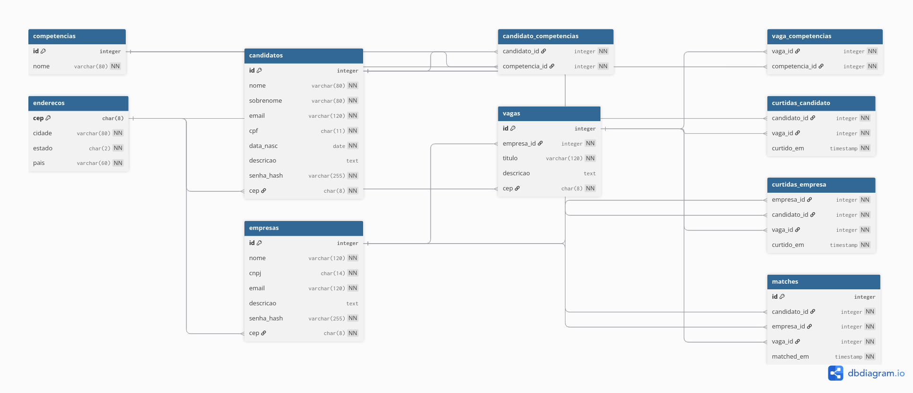

# Linketinder — Banco de Dados

Modelagem relacional do Linketinder em PostgreSQL.  
Ferramenta de modelagem: **[dbdiagram.io](https://dbdiagram.io)**

---

## DER



---

## Normalização

| Forma Normal | Regra aplicada |
|---|---|
| **1FN** | Todos os atributos são atômicos; competências extraídas para tabelas próprias |
| **2FN** | Cada atributo depende da chave primária inteira (sem dependências parciais) |
| **3FN** | CEP → cidade/estado extraídos para `enderecos`, eliminando dependências transitivas |

---

## Tabelas

| Tabela | Descrição |
|---|---|
| `candidatos` | Dados pessoais do candidato |
| `empresas` | Dados da empresa |
| `enderecos` | Resolve CEP → cidade/estado/país (3FN) |
| `competencias` | Catálogo único de competências |
| `candidato_competencias` | N:N candidato ↔ competência |
| `vagas` | Vagas criadas pelas empresas |
| `vaga_competencias` | N:N vaga ↔ competência |
| `curtidas_candidato` | Candidato curte vaga |
| `curtidas_empresa` | Empresa curte candidato |
| `matches` | Gerado quando há curtida mútua |

---

## Arquivos

```
der.pdf                      # PDF com as tabelas
DDL-LinkerTinder.sql         # DDL (Criação das tabelas)
DML-LinkerTinder.sql         # DML (Populando as tabelas)
DQL-LinkerTinder.sql         # DQL (Teste de relações entre tabelas)

```
